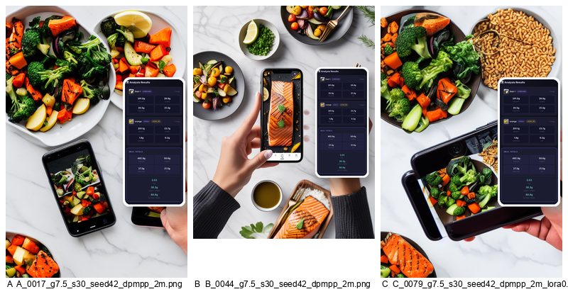
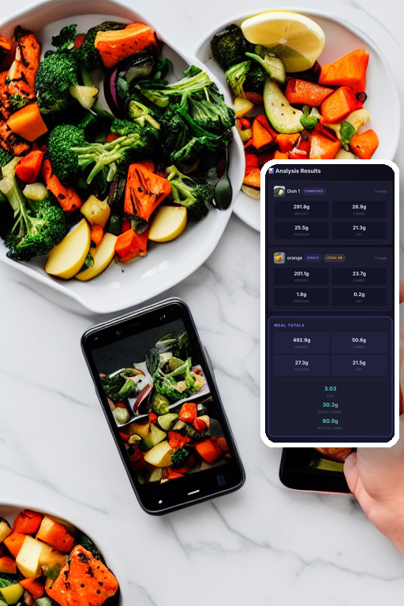
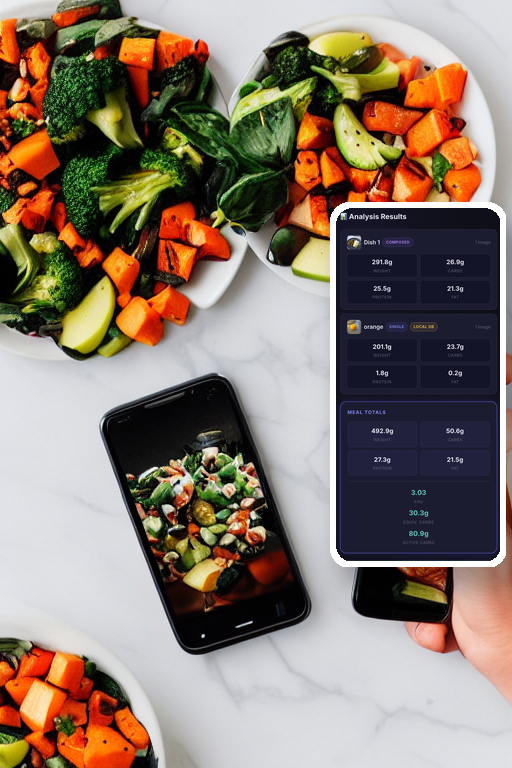
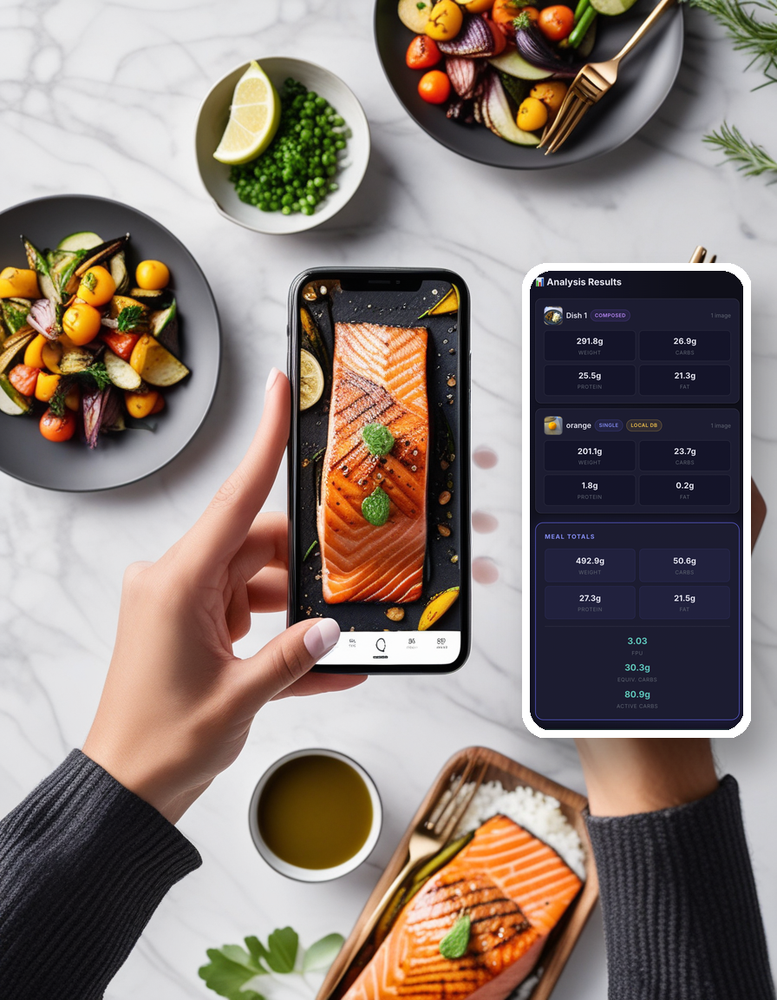
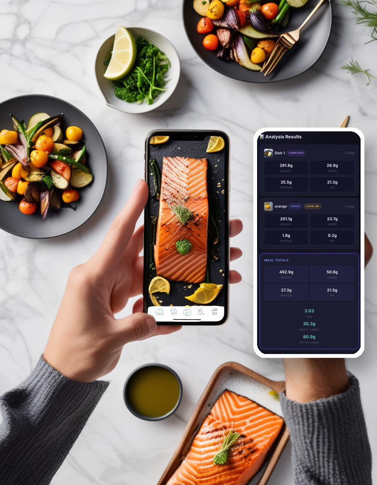
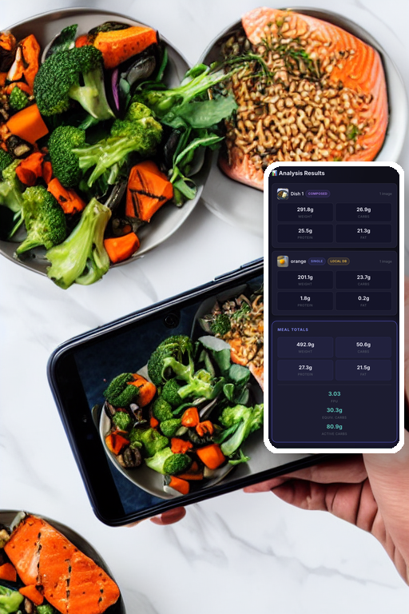
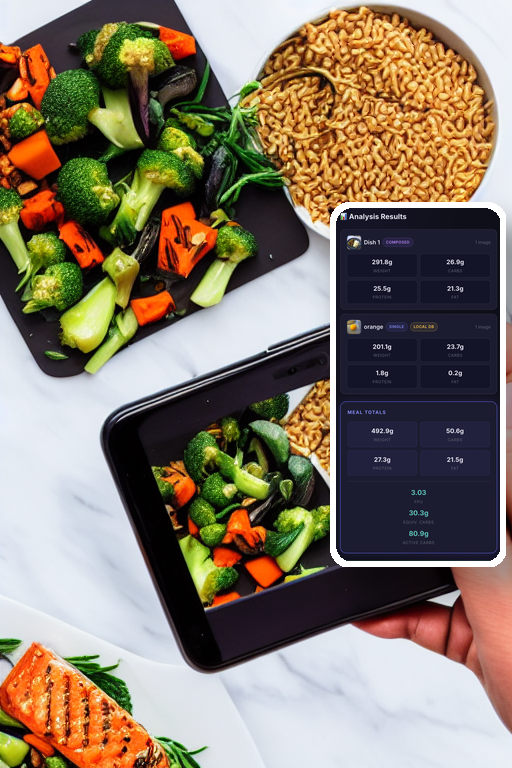

# L56_HomeWork — Comparative Study of Three Generative-Model Configurations

Side-by-side study of three diffusion configurations (SD 1.5, SDXL base 1.0, SD 1.5 + a 3D-render LoRA) generating the same marketing ad for the L41_HomeWork meal-recognition app, with deliberate parameter sweeps and an evidence-based write-up.

---

## 1. Project schema

Three configurations, two comparison axes, one shared brief.

| ID | Model | Role | Resolution |
|---|---|---|---|
| **A** | Stable Diffusion 1.5 (`stable-diffusion-v1-5/stable-diffusion-v1-5`) | Baseline diffusion | 512×768 |
| **B** | SDXL base 1.0 (`stabilityai/stable-diffusion-xl-base-1.0`) | Architecture / scale variant | 896×1152 |
| **C** | SD 1.5 + 3D-render LoRA (`artificialguybr/3d-redmond-1-5v-3d-render-style-for-liberte-redmond-sd-1-5`) | Control-surface variant — same base as A, adapter-modified | 512×768 |

- **Axis 1 (A ↔ B):** architecture and scale at matched prompt/seed/scheduler.
- **Axis 2 (A ↔ C):** control surface — base model vs. LoRA-adapted base model.

Matched-input principle (PRD FR-2): one shared prompt, one shared negative prompt, one shared camera angle. The only intentional difference between configs is the model itself (plus, for C, the LoRA trigger prefix, which is logged in every row of the param log).

**Parameter sweeps (PRD FR-3):**

- **A — 36 images:** `guidance ∈ {5, 7.5, 12}` × `steps ∈ {20, 30, 50}` × `seed ∈ {42, 123}` × `scheduler ∈ {ddim, dpmpp_2m}`.
- **B — 18 images:** same grid, scheduler fixed at `dpmpp_2m` (budget call — SDXL is ~4.6× slower per image).
- **C — 54 images:** same grid as B, plus `lora_scale ∈ {0.4, 0.7, 1.0}`.
- **108 images total.** Smoke set (12 hand-curated rows) runs first as a gate.

**Subject of the ad:** the L41_HomeWork project — *"Image-Based Carb & Macro Estimation for Insulin Dosing"*, a research-prototype mobile app that photographs a meal and returns carb/protein/fat estimates for insulin dosing. The medical disclaimer is honoured in the prompt and negatives (no clinical setting, no syringes/needles, no clinical claims in the image itself).

---

## 2. Data / process flow

```
config/*.yaml  +  prompts.yaml
        |
        v
   scripts/run_sweep.py
        |
        v
   src/models/loader.py  ---> DiffusionPipeline (A | B | C)
        |
        v
   text2img generation  (fp32 on MPS — see §7)
        |
        v
   PIL "UI card" overlay      <-- input/L41_app_screenshot.png
   (src/evaluation/overlay.py)
        |
        v
   output/images/<run_id>.png  +  one JSONL row in output/param_log.jsonl
        |
        v
   scripts/analyse.py
        |
        v
   output/analysis/  (summary_stats.md, comparison_tables.md,
                     contact sheets, axis grids, champions.md)
```

`input/` holds the user's real L41 app screenshot (read-only). It is **not** an `init_image` for the diffusion model — the model generates the scene from text only. The screenshot is composited in afterwards as a right-anchored UI card so the numbers in the ad are 100% accurate. (Why that decision was made: §7.)

---

## 3. Setup

Requirements: Python **3.12**, macOS on Apple Silicon (MPS). CUDA users: change `dtype: float32` to `float16` in `config/*.yaml` to recover the usual speed — fp32 is an MPS workaround, not a general rule (§7).

```bash
git clone <repo>
cd L56_HomeWork

python -m venv venv
source venv/bin/activate
pip install --upgrade pip
pip install -r requirements.txt
```

First run downloads ~15 GB of weights from Hugging Face (SD 1.5 ≈ 4 GB, SDXL fp32 ≈ 13 GB, LoRA ≈ 150 MB) into `~/.cache/huggingface/`. Subsequent runs use the cache.

---

## 4. How to run

All commands are run from the repo root with the venv active.

**Smoke set — 12 images, ~7 min on warm HF cache, gates the full sweep:**

```bash
python scripts/run_smoke.py
```

**Full sweep — 108 images, ~90 min on warm cache:**

```bash
python scripts/run_sweep.py
```

**Just one config (useful for iterating on a single model):**

```bash
python scripts/run_sweep.py --only A
python scripts/run_sweep.py --only B
python scripts/run_sweep.py --only C
```

**Regenerate analysis artefacts from `output/param_log.jsonl`:**

```bash
python scripts/analyse.py
```

`analyse.py` is idempotent — it rebuilds `output/analysis/summary_stats.md`, `comparison_tables.md`, the `contact_*.png` sheets, the `axis_*.png` grids, and `comparison_matched.png` straight from the JSONL log. The log is the source of truth; the markdown files derive from it.

---

## 5. Results

### 5.1 Headline numbers

Source: `output/analysis/summary_stats.md` (derived from 108 rows of `output/param_log.jsonl`).

| Config | n | mean time (s) | median (s) | mean peak memory (MB) | dtype |
|---|---|---|---|---|---|
| A — SD 1.5 | 36 | **29.5** | 26.4 | **7 523** | fp32 |
| B — SDXL base | 18 | **135.4** | 124.0 | **21 846** | fp32 |
| C — SD 1.5 + LoRA | 54 | **32.8** | 29.4 | **8 148** | fp32 |

Three numbers do the most work in the comparison:

- **B is 4.6× slower than A per image** (135.4 s vs. 29.5 s) and uses **~2.9× the memory** (21.8 GB vs. 7.5 GB) — the latter sitting right against the 24 GB unified-memory ceiling on this M4 Pro.
- **C costs almost nothing extra over A in compute:** +11% wall-clock, +8% memory. The cost of LoRA in this project is *narrative*, not compute (see §5.4).
- A single SDXL run on a cold HF cache had a **22 min weight-download tax** before generation started (fp32 weights for SDXL are ~13 GB; see §6 for why fp32).

### 5.2 Matched comparison — same seed, same params, three models

This is the single most important image in the project: identical guidance, steps, seed, scheduler, and prompt across all three configs.



Reading the panel left-to-right:

- **A (SD 1.5)** produces a coherent overhead flat-lay but the in-scene phone is small and the marble surface reads as flat. Composition is correct; production value is modest.
- **B (SDXL)** lifts the same prompt to a magazine spread: cutlery, oil bowl, herb garnish, lemon wedges, the hand-with-phone reads as the hero element. This is what 4.6× the compute buys.
- **C (SD 1.5 + LoRA at scale 0.7)** swings the aesthetic — dark serving tray, glossy 3D-render lighting, saturated greens. Same base model as A, but unmistakably a different look.

### 5.3 Config A — SD 1.5 baseline



Default-tier render: phone bottom-left, multi-plate arrangement around it, marble countertop. Clean and on-brief.



Same coord at 50 steps. Broccoli florets and carrots resolve to distinct shapes — A responds visibly to step count past 30, with diminishing returns.

**Scheduler finding (A only — DDIM vs. DPM++ 2M was swept on Config A as a budget call):** at low step counts, DPM++ 2M converges visibly cleaner than DDIM at the same seed. Compare `output/images/A_0012_g7.5_s20_seed42_ddim.png` against `A_0013_g7.5_s20_seed42_dpmpp_2m.png` — same prompt, same seed, same 20 steps. See `output/analysis/axis_scheduler_A.png` for the full grid. DPM++ 2M was therefore fixed for B and C.

### 5.4 Config B — SDXL base 1.0



Multiple plates of salmon, fresh herbs, lemon wedges, an oil bowl, hand-held phone as hero. This is what 135 s/image buys.



At 50 steps the cable-knit pattern on the sleeve resolves cleanly. Both A and B reward extra steps, but B starts from a much higher baseline.

**SDXL failure mode worth naming:** at g=12, SDXL hallucinates a *second photo inside the phone's screen* — a viewfinder that was not asked for (`output/images/B_0050_g12_s30_seed42_dpmpp_2m.png`). A "more is more" failure: extra guidance pushed the model to over-resolve a plausible but unprompted element.

### 5.5 Config C — SD 1.5 + 3D-render LoRA

The LoRA exposes a knob A does not have: `lora_scale`. Three values were swept (0.4 / 0.7 / 1.0). The headline finding:



At `lora_scale = 0.7`, the LoRA's 3D-render aesthetic dominates: dark serving trays, glossy reflective sheen, saturated colour. Distinct from anything A produces, while still parseable as a food ad.



At `lora_scale = 0.4`, the framing still includes the phone and marble (much like A), but the food has the LoRA's glossy finish. This is the "before" in a before/after pair with the 0.7 image.

**LoRA composition trade-off (the most interesting finding of axis 2):** at `lora_scale ≥ 0.7` the LoRA begins to override parts of the prompt. The LoRA was trained on product-render shots without phones, and at strength 1.0 it removes the in-scene phone and the photographer's hand entirely — pulling the scene toward generic dark-tray product photography (`output/images/C_0098_g12_s30_seed42_dpmpp_2m_lora1.png`). The full strength grid is `output/analysis/axis_lora_C.png`. **0.7 is the recommended setting** — strong style, prompt still mostly honoured.

### 5.6 Selected rows from the comparison tables

Full tables in [`output/analysis/comparison_tables.md`](output/analysis/comparison_tables.md). The most important rows pasted inline:

**Axis 1 — A vs. B (architecture / scale):**

| Dimension | A — SD 1.5 | B — SDXL |
|---|---|---|
| Mean generation time | 29.5 s / image | 135.4 s / image — **4.6× slower** |
| Peak memory | 7.5 GB | 21.8 GB — **near 24 GB ceiling** |
| Sensitivity to guidance | Subtle — composition unchanged across g=5/7.5/12 | Marked — g=5 washed, g=7.5 editorial, g=12 saturates and hallucinates a viewfinder |
| Sensitivity to steps | Diminishing past 30 | Diminishing past 30; 50 buys cleaner fabric texture |

**Axis 2 — A vs. C (control surface):**

| Dimension | A — SD 1.5 | C — SD 1.5 + LoRA |
|---|---|---|
| Style transfer | n/a (baseline) | Yes, dominates progressively with `lora_scale` |
| Composition preservation | Baseline — phone retained in every (g, steps, seed) | Breaks above 0.7 — LoRA distribution overrides prompt |
| Time overhead from LoRA | — | +3.3 s / image (+11%) |
| Memory overhead | — | +625 MB (+8%) |
| Best `lora_scale` | n/a | **0.7** — strong style without losing the subject |

---

## 6. Cross-axis takeaways

1. **B is 4.6× slower than A and 2.9× the memory**, but at the same seed/guidance/steps it produces visibly higher-quality compositions. The trade is real and measurable, not subjective.
2. **C buys a strong stylistic axis for nearly free in compute** (+11% time, +8% memory). The actual cost of LoRA in this project is the *narrative* one: the LoRA's training distribution overrides parts of the prompt at `lora_scale ≥ 0.7`.
3. **Scheduler matters on SD 1.5 at low step counts.** DPM++ 2M > DDIM, especially at 20 steps. Fixing DPM++ 2M for B and C was the right budget call.
4. **The model never draws the UI.** The numbers visible in every ad are a PIL-composited overlay of the user's real app screenshot. SD 1.5 and SDXL both fail at small legible UI text — accepting that limit and compositing post-hoc gave every config a fair chance at the scene without penalising any of them on text rendering. The justification for this decision is the iteration story in §7.

---

## 7. Conclusions and observations — the journey

The final pipeline (text2img, fp32, portrait 3:4, PIL UI overlay) is not what the project started with. The detour matters: three things broke before the pipeline produced anything useful, and each break taught something the abstract architecture comparison would not have.

### The MPS fp16 VAE NaN bug — and the cost of the fix

First 12 smoke renders were uniformly black PNGs. `diffusers` was logging `RuntimeWarning: invalid value encountered in cast` — the VAE was decoding NaNs on MPS. Disabling the SD 1.5 safety-checker did nothing. Switching SDXL to `madebyollin/sdxl-vae-fp16-fix` did nothing. Upcasting only the VAE while keeping the UNet in fp16 did nothing. The NaN was inside the UNet itself, not just the VAE — a known issue on macOS MPS with fp16 in 2025-26.

Resolution: full **fp32** for all three configs. The cost was concrete and asymmetric:

- A and C (SD 1.5): essentially free — SD 1.5 fp32 weights are small, no perceptible speed hit on M4 Pro MPS at 512×768.
- B (SDXL): a **22-minute cold-cache weight download** (fp32 weights are ~13 GB vs. the fp16 variant's ~6 GB), and per-image generation lands at 135 s versus the ~80 s expected at fp16. That is the real bill for correctness on MPS.

This is the kind of trade-off you cannot derive from the architecture page on Hugging Face. You only feel it once you have black PNGs and a sweep schedule to honour.

### The img2img dead-end

The first pipeline design tried to be clever: paste the user's L41 app screenshot into the canvas as `init_image`, let `StableDiffusionImg2ImgPipeline` stylise the surroundings, vary `strength`. This was the obvious move on paper — "use img2img to keep the UI accurate".

It failed for a fundamental reason. With a single `strength` knob, img2img cannot simultaneously *preserve* one part of the canvas (the UI) and *invent* a completely new scene around it. At `strength = 0.4` the UI was preserved but nothing else changed — the model returned the input image with mild gloss. At `strength = 0.85` the UI text turned into illegible glyph soup. Shrinking the phone and leaving empty canvas for the model to fill (iteration 3) did not help — the empty half stayed empty. There is no `strength` value that simultaneously preserves a logo and paints food next to it, not without masking, inpainting or ControlNet.

The fix was to give up the cleverness. Let the model do what diffusion models actually do — text-to-image scene generation — and composite the screenshot in afterwards with PIL. The model gets to invent the scene freely; the UI is 100% accurate by construction.

### The "two phones" problem

After pivoting to text2img the prompt asked for a person *photographing* food, which means the model needs to draw a phone in the scene. But the PIL overlay was also a phone (initially rendered with a bezel and drop-shadow), placed in the bottom-right corner. SDXL in particular kept rendering its own phone next to ours — two phones, side by side, visible in every other output.

The fix was to drop the device framing on the overlay entirely. The screenshot is now rendered as a **white-bordered card with a drop-shadow**, anchored to the right edge of the canvas (X centre 0.82, Y centre 0.50, 46% of canvas height). It reads as a *UI callout panel* alongside the photograph — not a second device. The numbers in the UI are now large enough to read, and no configuration produces a "two phones" artefact at any seed in the final sweep.

### CLIP truncates the prompt

A small honest caveat: the project prompt is 91 tokens after tokenisation, and CLIP's text encoder caps at 77 — `diffusers` silently drops the tail `"keynote editorial aesthetic, ultra-detailed, 8k food product photography"` on every SD 1.5 generation (A and C). SDXL has two text encoders with a 77+77 window so it can fit more, but is not immune. The truncation is deterministic and identical across configs, so it does not break the "matched inputs" comparison — every model is matched on the *same* truncated prompt. But the prompt the README quotes is not literally the one the SD 1.5 UNet saw. Fixing this cleanly needs `compel` or a similar prompt-weighting library; out of scope for this iteration.

### What this project actually proved about generative-model trade-offs

Three things, none of which were obvious before running the sweep:

1. **Architecture upgrades cost roughly what you'd guess from the parameter count, but their benefit is non-linear.** SDXL is 4.6× slower than SD 1.5 and uses ~3× the memory — those are linear-ish numbers. The output quality jump from "competent flat-lay" (A) to "magazine spread with cutlery and herb garnish" (B) at the *same* seed is not linear. It is the difference between an image you would include in a school project and an image you would put in front of a client. That gap is what you pay 4.6× for.
2. **LoRA is the cheapest control surface you can buy.** +11% wall-clock, +8% memory, and you get a stylistic axis with a knob (`lora_scale`) that responds smoothly. The cost is in the prompt: the LoRA's training distribution will fight your prompt at high scales. 0.7 was the sweet spot here; the right scale will depend on how aligned your LoRA's training subject is with your prompt's subject.
3. **The "matched inputs" assumption from PRD §FR-2 is easier to write than to execute.** Two of the three pipeline pivots above (img2img → text2img, bezel overlay → card overlay) were forced by *cross-model* artefacts that did not appear when each config was developed in isolation. The single most useful artefact in the whole project — `output/analysis/comparison_matched.png` — exists because every other version of the pipeline produced an image at one config that was incomparable to the same parameters at another. Designing for a fair comparison is more constraining than designing for a single good image.

---

**Reproducibility note.** Every result above is derivable from `output/param_log.jsonl` and the seeds/configs checked into `config/`. A fresh clone, `pip install -r requirements.txt`, and `python scripts/run_smoke.py` should reproduce the smoke set; `python scripts/run_sweep.py` reproduces the full 108-image sweep. The qualitative claims in §5 each cite a specific PNG by filename so any line can be re-verified by opening the named file.
